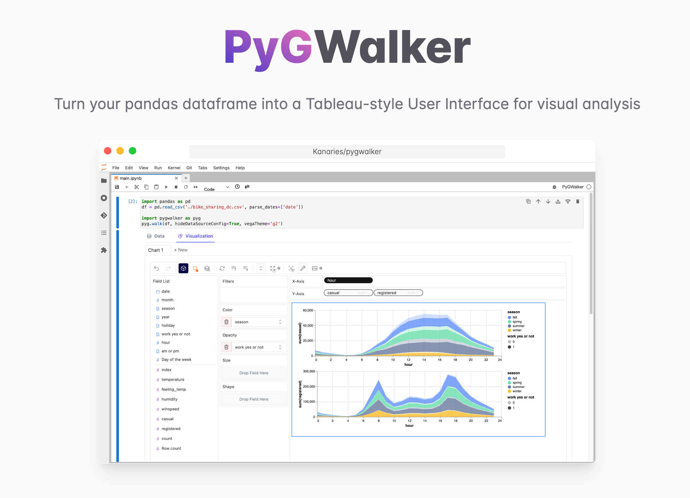

# Low code tools

This library contain different low code tools for data analysis. 

- PyGWalker: 

PyGWalker can simplify your Jupyter Notebook data analysis and data visualization workflow, by turning your pandas dataframe (and polars dataframe) into a Tableau-style User Interface for visual exploration.

Get more information on [GitHub](https://github.com/Kanaries/pygwalker)

  


- Visual Python:

Visual Python is an open source project started for students who struggle with coding during Python classes for data science, is a GUI-based Python code generator for data science.

Get more information on [Visual Python](https://visual-python.gitbook.io/docs/getting-started/welcome-to-visual-python)

 

- YData Profiling:

Is a leading package for data profiling, that automates and standardizes the generation of detailed reports, complete with statistics and visualizations. The significance of the package lies in how it streamlines the process of understanding and preparing data for analysis in a single line of code.

Get more information on [Ydata Profiling](https://docs.profiling.ydata.ai/4.6/)

 

## Load library

Install python library

```bash
pip install pygwalker
pip install ydata-profiling
```
    
## Author

- [@Sebastian Hernandez](https://github.com/JuanSebastianHernandezGomez/)

